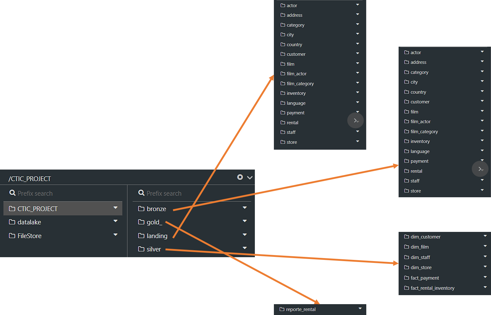

# CTIC BIG DATA PROJECT
Proyecto final para el Curso de Big Data and Analytics de CTIC-UNI.

* Autor: Aaron Calderon Guillermo

# RESUMEN

# POSTGRESQL

* Objetivo: Programar la base de datos

Se utilizó un host de POSTGRESQL mediante [Clever Cloud](https://console.clever-cloud.com/). La base de datos se obtuvo de [Internet](https://www.postgresqltutorial.com/postgresql-getting-started/load-postgresql-sample-database/). El diagrama entidad relacion es el siguiente:

# DATABRICKS

* Objetivo: Establecer el Data Lake (landing, bronze, silver, gold).

Se trabajo en [Databricks Community](https://community.cloud.databricks.com/). La estructura es la siguiente:

# POWER BI

* Objetivo: Hacer un dashboard usando el reporte de la capa Gold.

